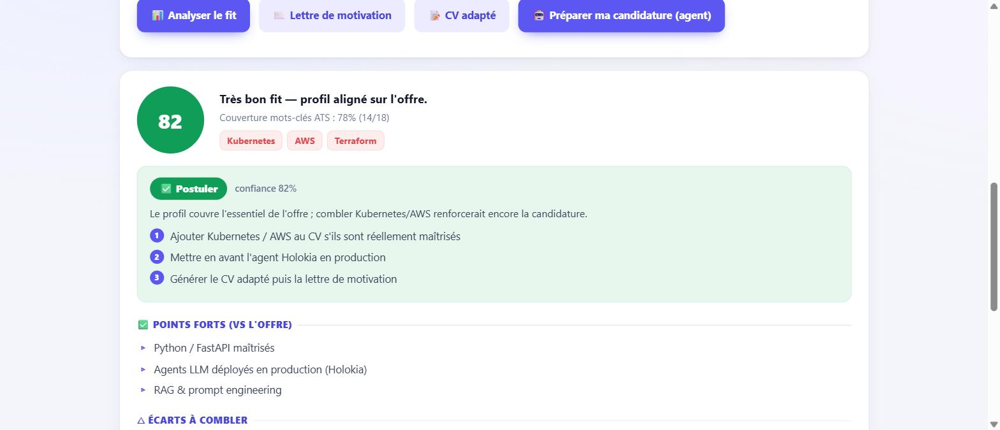

# 🎯 Career Match Agent — tailor your application to any job offer, any field

[](https://github.com/Yoh5/career_match_agent/actions/workflows/tests.yml)



Upload your CV, paste a job/internship offer → the agent **scores the fit**, gives a **go/no-go recommendation with a prioritised action plan**, tells you **which projects to highlight**, **suggests concrete CV improvements to raise the score**, and generates an **ATS-optimised, tailored CV** and **cover letter** — in **French or English**.

> **Any field, not just tech.** ATS keywords are extracted *from the offer itself* by the LLM (marketing, finance, HR, healthcare, legal, sales, engineering…), so the signal is relevant whatever the role — a curated tech list only acts as a deterministic fallback.
>
> Built for a real need: apply *strategically* instead of sending the same CV everywhere. The agent reasons over the CV **and** the offer, and blends a **deterministic ATS keyword signal** with LLM analysis.
>
> **Integrity by design:** it never fabricates — it only reorganises, rephrases and surfaces what is genuinely in your CV.

**Stack:** Python · FastAPI · OpenAI (tool-calling) · pypdf + pdfminer.six / python-docx · vanilla-JS frontend · 175 unit tests (no network, no API key)

---

## ✨ What it does

| Capability | Detail |
|---|---|
| 📊 **Fit score (0–100)** | LLM assessment + a **deterministic ATS keyword-coverage %** (which offer keywords are/aren't in your CV) — an objective signal, not just vibes. |
| ⚖️ **Weighted coverage** | Not every keyword is worth the same: a term under *“profil recherché / requirements”* counts **double**, a *“nice to have”* counts **0.6**, and a term repeated three times counts more. You also get `critical_missing` — the misses that actually get you screened out. |
| 📌 **Projects to highlight** | Which of *your* projects to emphasise **for this specific offer**, and why. |
| ✎ **CV improvement suggestions** | Concrete, actionable edits (wording, missing keywords, ordering, quantification) to raise the score. |
| 📝 **Tailored CV** | Your CV rewritten & reordered for the offer, **ATS-friendly** (standard sections, exact keywords you truly have). |
| 🔬 **ATS parse audit** | The check nobody does: the agent **re-extracts the PDF it just produced, exactly as an ATS would**, and reports what survived — keywords lost to the layout, e-mail/phone still findable, sections still identifiable. Works on **your own CV too**, not just generated ones. See below. |
| 📄 **Two PDF layouts** | **ATS (default)** — single column, canonical headings, monochrome: the one to drop on a portal. **Designed** — two columns with a coloured header, for sending straight to a human. You get both, and the audit tells you what each costs. |
| ✉️ **Cover letter** | Tailored to the offer, tone-selectable, grounded in your real experience. |
| ⬇️ **Word & PDF downloads** | Everywhere — single offer *and* pipeline — the cover letter downloads as **.docx** and the tailored CV as a PDF in **either layout** (pure Python, no headless browser). |
| 🧭 **Go / no-go recommendation** | *Apply · strengthen first · skip* + a **prioritised action plan** — decision, not just data. |
| 🌍 **Bilingual** | All outputs in **French or English** (your choice). |
| 🛡️ **ATS-optimised — and verified** | Plain, keyword-aligned, parsable output; then the PDF is **re-parsed and scored** to prove it survived the export, instead of taking the layout's word for it. |
| 🔁 **Agentic optimisation loops** | Neither the CV nor the letter is a one-shot: the agent **generates → measures ATS coverage *and* writing quality (both deterministic) → verifies integrity → revises → proofreads**, keeping the best version. Two measurable objectives, not vibes. |
| ✍️ **Writing-quality gate** | A deterministic checker (`quality.py`, no LLM) flags unfilled placeholders, **language mixing** (English left in a French letter), repeated words, spacing and French typography, AI preambles — then drives a targeted proofread. Scores are shown in the UI. |
| 🤖 **Autonomous agent (tool-calling)** | `/prepare` runs a **ReAct loop**: the LLM *chooses* which tools to call (measure ATS, analyse, recall memory, recommend, write CV/letter) and in what order — every step is traced. |
| 🧠 **Long-term memory** | Remembers offers already analysed and **recurring gaps** across offers ("you're often missing X") to sharpen future advice. |
| 🔎 **Internship sourcing** | Describe the internship you want (free text) + keywords/location → the agent searches the sources **you pick from its catalog** (verified public ATS boards incl. French companies, RemoteOK, Jobicy-France, Arbeitnow-EU, any custom **RSS feed** — e.g. Novojob for Morocco/Africa) with FR/EN location aliases (*Maroc ↔ Morocco ↔ Casablanca…*). |
| 🏆 **Relevance ranking** | Every sourced offer gets a deterministic **match %** — coverage of *your target description's* keywords in the offer, blended with how much of the offer's keywords your CV already has. Best matches first. |
| 🗂️ **Application pipeline** | Each offer moves through `sourced → analyzed → ready → applied/skipped`. Per offer — or **top-5 in one click** — the agent builds the **full application kit**: tailored CV (**PDF, ATS layout by default**), cover letter (**Word .docx**), outreach messages. |
| ✍️ **Your templates + letter prompt** | LinkedIn invite (≤300 chars), message and e-mail from **your editable templates**; plus a free-text **letter prompt** ("punchy opening, 3 short paragraphs, highlight my AI projects…") that shapes how every cover letter is written. |
| 🚀 **Reviewed apply flow** | Before applying to any offer the agent **shows you the CV and the letter**; you confirm → it opens the offer page and marks it applied. **It never submits for you.** |

## 🛡️ Why it never auto-applies (by design)

Auto-submitting on LinkedIn/Indeed violates their ToS, gets real accounts banned, and dies on CAPTCHAs. Like the best tools in this space (career-ops: *"it never submits, sends, or clicks anything"*), this agent is **a filter and a builder, not a spray-and-pray auto-applier**: it sources from job boards companies *voluntarily* expose as public JSON APIs (plus any RSS feed you add), ranks, and prepares everything — then **shows you each CV + letter for review before you make the final send** on the offer's own page.

## 🔬 The ATS parse audit — what the robot *actually* reads

Every CV tool on the market optimises the **text**. But you don't upload text to a job
portal, you upload a **PDF** — and between the two, the layout can destroy everything.
A CV scoring 92 % on keyword coverage can arrive at the recruiter as a wall of isolated
letters, and nobody finds out.

`core/atscheck.py` closes that gap. It **re-extracts the generated PDF the way an ATS
does**, and measures what survived:

```
tailored CV (Markdown)  ──► export.cv_pdf(layout="ats")  ──► PDF bytes
                                                              │
                                        ┌─────────────────────┴─────────────────────┐
                                        ▼                                           ▼
                                  pypdf extract                            pdfminer.six extract
                                        └─────────────────────┬─────────────────────┘
                                                              ▼
                                              audit: keywords lost? e-mail findable?
                                              sections identifiable? text exploded
                                              letter-by-letter? columns interleaved?
                                                              ▼
                                                   score 0-100 = the WORST engine
```

**Why two extractors.** An ATS is a black box — you don't know which parser sits behind
the portal, and they don't agree. On a real Canva-exported CV, `pypdf` returns
`D é v e l o p p e m e n t` (every glyph separated: **zero keywords matchable**) while
`pdfminer.six` reconstructs the words but glues lines together and scrambles the reading
order. Scoring the **worst** engine is the only honest call: you don't get to pick the
recruiter's tool.

What it catches, all deterministic, no LLM:

| Check | Why it sinks an application |
|---|---|
| `not_extractable` | CV exported as an image or outlines — the ATS reads **nothing**. Instant 0. |
| `char_spacing` | Text extracted letter-by-letter (Canva/Figma per-glyph positioning): looks perfect on screen, matches no keyword. |
| `keyword_loss` | Keywords present in the CV text but **gone from the PDF** — the layout ate them. The most actionable signal there is. |
| `glued_contact` | `AxelAHOaho.axel5@gmail.com` — the ATS stores a broken address and the interview invite goes nowhere. |
| `contact_buried` | Contact block found at 35 % of the document instead of the header: reading order is scrambled. |
| `column_interleave` | A section heading found mid-line — the parser is mixing your sidebar into your job descriptions. |
| `missing_sections` · `no_dates` | Experience/Education/Skills unidentifiable, or no parsable years: no seniority computed. |
| `glued_words` · `glued_lines` · `mangled_chars` | Lost spaces and accents mangled into `?` at export. |

Two entry points:

```bash
POST /ats-check            # multipart: audit ANY PDF — including the CV you already use
POST /ats-check/compare    # render both layouts, audit each, recommend one (ties go to ATS)
```

and the report rides along with every generated CV (`ats_parse` in `/tailored-cv` and in
each prepared pipeline kit), so the promise *"ATS-optimised"* is a **measurement**, not a
claim.

## 🔁 The agentic loops (tailored CV **and** cover letter)

Both documents are produced by a bounded loop with **two deterministic objective functions** — ATS relevance (`ats.py`) and **writing quality** (`quality.py`) — plus an anti-fabrication gate:

```
generate
  └─► loop (bounded):
        measure   ats.coverage(doc, offer_keywords)   ← relevance, deterministic %
        measure   quality.score(doc, lang)            ← correctness, deterministic 0-100
        verify    verify_grounding(doc, base_cv)      ← anti-fabrication check
        if ATS ≥ target AND quality ≥ target AND no invented claims → stop
        if the revision changed nothing (fingerprint) → stop        ← convergence
        else revise (real missing keywords + unsupported claims + writing defects)
  └─► keep the BEST version: integrity first, then a 70/30 ATS-quality composite
  └─► polish: targeted proofread, kept only if it measurably improves AND invents nothing
```

`quality.py` catches exactly what an LLM gets wrong in an application, **without any LLM call**: unfilled placeholders (`[Company]`, `XXX`), **language mixing** (English sentences left in a French letter — measured on *function words*, so "Machine Learning" is never flagged), repeated words, spacing and French typography, leftover AI preambles. On a deliberately broken letter the loop takes writing quality from **10/100 to 100/100**.

**Efficiency:** one ATS measurement per round (the coverage dict already carries both `pct` and `missing`), grounding results are memoised per version instead of being recomputed at the end, the loop stops on convergence, and a revision that regresses never overwrites the best version.

## 🤖 Why it's a real agent (not a prompt wrapper)

| Agent trait | Here |
|---|---|
| **Autonomous tool-use** | `/prepare` = a ReAct loop where the LLM *decides* which tools to call (fetch offer, measure ATS, analyse, recall memory, recommend, write CV/letter) — `core/orchestrator.py`. |
| **Goal-directed loops** | `optimize_cv` and `optimize_cover_letter` iterate toward measurable ATS **and** writing-quality targets, behind an anti-fabrication gate. |
| **Self-critique** | `verify_grounding` checks each claim against the base CV, and `quality.py` scores the writing — both drive the revision prompt. |
| **Planning** | `recommend` turns the assessment into a go/no-go decision + ordered action plan. |
| **Long-term memory** | `core/memory.py` remembers offers and surfaces recurring gaps across sessions. |

Every step is **traced** and shown in the UI, and every LLM call is **fail-open** (a failure degrades gracefully instead of crashing).

## 🏗️ How it works

```
CV (PDF/DOCX/TXT/MD) ──► extract.py         plain text
Job offer (text/URL) ──► extract.fetch_url  plain text
        │
        ├─► ats.py         deterministic: offer keywords → coverage % vs CV, weighted by
        │                  how much the offer insists on each one          (tested, no LLM)
        ├─► agent.py       LLM: fit score, strengths/gaps, projects, CV suggestions,
        │                  cover letter, and an agentic optimise_cv() loop
        │                  (generate → measure → verify_grounding → revise)
        └─► atscheck.py    the generated PDF, re-extracted like an ATS would:
                           what actually survives the layout               (tested, no LLM)
```

The **ATS layer is deterministic and unit-tested** — it doubles as the loop's objective function; the LLM layer adds the reasoning. Every LLM function returns `(result, err)` — the API surfaces a clear error instead of crashing.

## 🚀 Quickstart

```bash
cd backend
python -m venv venv && venv\Scripts\activate      # Windows (source venv/bin/activate on Unix)
pip install -r requirements.txt
copy .env.example .env                             # then set OPENAI_API_KEY

uvicorn app:app --reload                            # → http://localhost:8000
```
Open `http://localhost:8000`, upload your CV, paste an offer, and go.

```bash
python -m pytest tests/ -q                          # 175 tests, no network / no API key
```

## 🔌 API

| Endpoint | Body | Returns |
|---|---|---|
| `POST /extract-cv` | multipart file | `{cv_text, chars}` |
| `POST /analyze` | `{cv_text, offer_text\|offer_url, lang}` | `{ats, keywords, analysis, recommendation, memory}` |
| `POST /cover-letter` | `{cv_text, offer_text, lang, tone, letter_style}` | `{cover_letter, quality_start, quality_final, quality_issues, iterations, unsupported_final}` |
| `POST /tailored-cv` | `{cv_text, offer_text, lang}` | `{tailored_cv_markdown, tailored_cv_html, ats_start, ats_final, ats_weighted_final, critical_missing, ats_parse, iterations, unsupported_final}` |
| `POST /ats-check` | multipart `file` (+ `offer_text`) | parse audit of **any** CV PDF — score, issues, contact/sections found, per-engine detail |
| `POST /ats-check/compare` | `{cv_markdown, cv_structured, lang}` | both layouts rendered + audited + `recommended` |
| `POST /prepare` | `{cv_text, offer_text\|offer_url, lang}` | `{steps[], analysis, ats, recommendation, cover_letter, tailored_cv, summary}` (autonomous agent) |
| `GET /memory` | — | `{count, avg_fit, recurring_gaps[]}` |
| `GET /sources` | — | catalog of sources the agent proposes (pick all / some) |
| `POST /source` | `{target_description, cv_text, keywords[], location[], greenhouse[], lever[], ashby[], remoteok, jobicy, arbeitnow, rss[], internship_only}` | offers **ranked by match %** → pipeline |
| `GET /pipeline` | `?status=` | `{stats, items[]}` (best matches first) |
| `POST /pipeline/{id}/analyze` | `{cv_text, lang}` | fit + ATS + go/no-go for that offer |
| `POST /pipeline/{id}/prepare` | `{cv_text, lang, tone, my_name, first_name, letter_style}` | full kit: CV md+HTML, letter, outreach messages |
| `GET /pipeline/{id}/letter.docx` · `GET /pipeline/{id}/cv.pdf` | — | cover letter as **Word**, tailored CV as **designed PDF** |
| `GET \| PUT /templates` | `{templates}` | message templates + the cover-letter **prompt** |
| `POST /export/letter.docx` · `POST /export/cv.pdf` | `{text}` · `{cv_markdown, cv_structured, lang}` | any letter → **Word**, any tailored CV → **designed PDF** (used by the single-offer flow) |

## 🗂️ Layout

```
backend/
  app.py            FastAPI + serves the frontend
  core/
    llm.py          OpenAI client (chat + tool-calling) + tolerant JSON parse
    ats.py          deterministic keyword extraction + coverage, accent/alias/plural
                    tolerant, weighted by required-vs-nice-to-have (tested)
    atscheck.py     ATS parse audit: re-extracts the PDF with pypdf AND pdfminer.six,
                    scores the worst — keyword loss, char spacing, column interleave,
                    contact & sections detectability (tested, no LLM)
    extract.py      CV text (PDF/DOCX/TXT/MD) + offer URL → text
    agent.py        offer_keywords (any-field ATS) · analyze · recommend (go/no-go) ·
                    cover_letter · tailored_cv · verify_grounding · optimize_cv (loop)
    memory.py       long-term memory: offers seen + recurring gaps (fail-open)
    orchestrator.py ReAct agent — LLM chooses tools until the application is ready
    render.py       CV → designed HTML (2-col template from structured JSON) + Markdown fallback
    sources.py      sourcing catalog + connectors (Greenhouse/Lever/Ashby/RemoteOK/Jobicy/
                    Arbeitnow/any RSS) + deterministic relevance ranking (rank_offers)
    pipeline.py     persistent application queue: sourced → analyzed → ready → applied/skipped
    templates.py    your editable message templates + cover-letter prompt (tolerant rendering)
    export.py       cover letter → Word (.docx) · tailored CV → PDF (fpdf2), two layouts:
                    "ats" 1-column (default, for the robot) · "designed" 2-column (for a human)
    quality.py      deterministic writing-quality score: placeholders, language mixing,
                    typos, French typography, AI artefacts (the loops' 2nd objective)
  tests/            175 unit tests (agent, ats, atscheck, memory, orchestrator, render,
                    extract, app, sources, pipeline, templates, export, quality, loops)
frontend/index.html  single-page UI (light/dark)
```

---

*Built by [Axel AHO](https://github.com/Yoh5) — AI/Agent engineering, automation, Python.*
